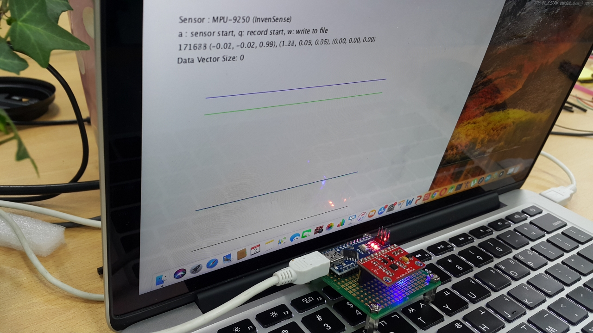
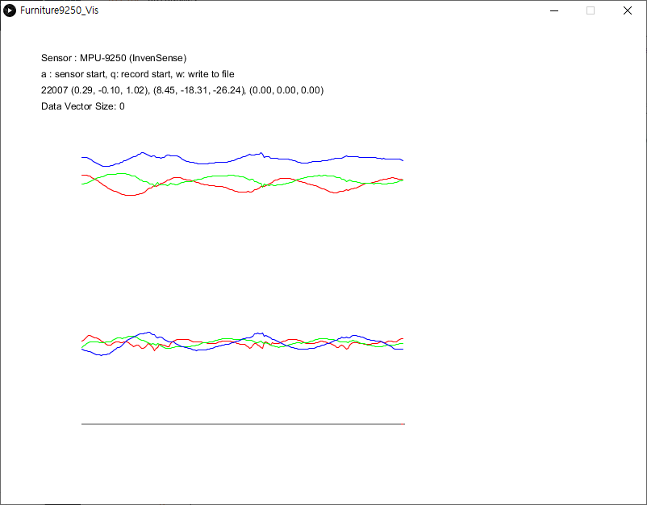
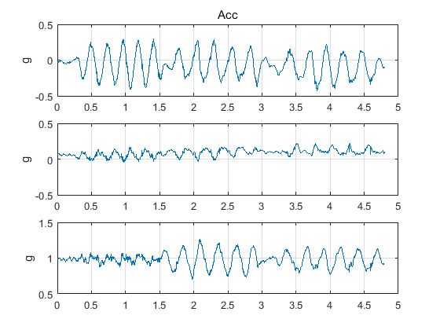
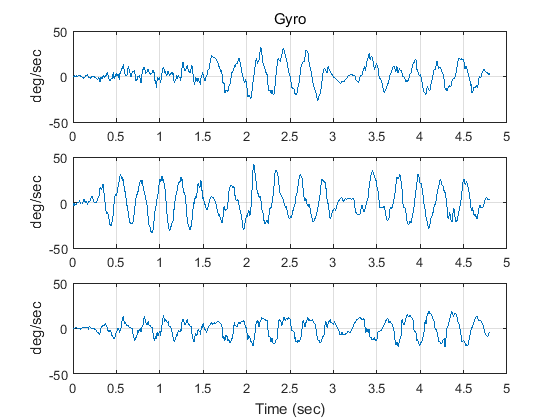

# Furniture
An old project (2018 January) for capturing inertial movements


### Arduino code
Ardiono code for MPU9250 

```
FurnitureJ
```

### Processing code
Visualization Software
```
Furniture9250_Vis
```

### Screenshots







